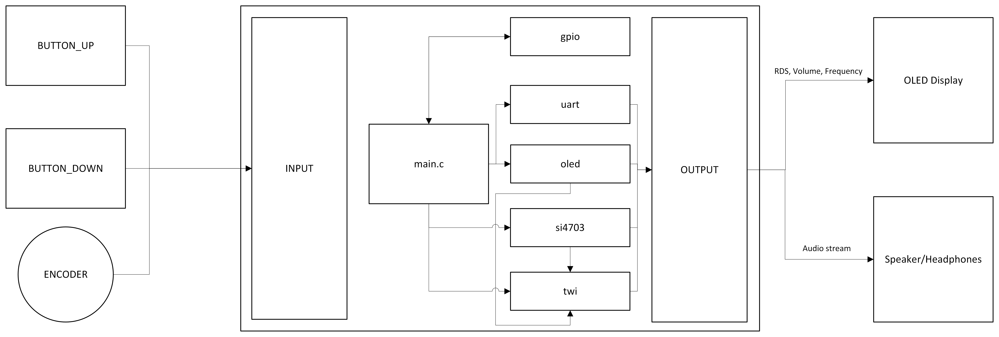
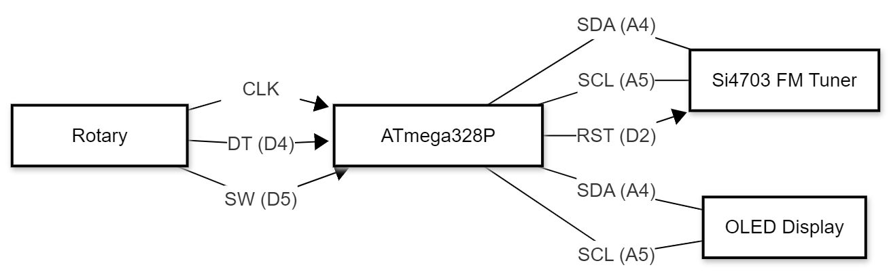

# FM-Receiver-Project
## Project description
This project tries to get a radio module Si4703, up and running, so that we can receive FM frequencies. There are two modes of changing frequencies. A seeking one and a manual one. We seek frequencies up with pressing the encoder button. An OLED display is used for showing the current station name using RDS and frequency. The main issue of this project is that all the documentation and example programs for this module is written in C++ and relies on Arduino libraries, but we´ve decided to write everything in C without using them. To solve this issue we must rewrite our libraries to C, while keeping their functionality as similar as possible. Instead of Arduino libraries we use Community created UART, I2C, OLED and timer libraries.

## Our Team
- Střítežský Jiří - (Encoder, Radio module library conversion)
- Svoboda Patrik - (Readme, poster design, visuals)
- Javůrek Kryštof - (Main.c code, debugging)

## Project Challenges
- C++ to C library conversion
- Encoder implementation and debounce
- Frequency seeking
- Keeping it simple but effective

## Component table

| **Component**             | **Description**                                                                                   | **Justification for Use**                                                                                                                                                                                                                             |
| ------------------------- | ------------------------------------------------------------------------------------------------- | ----------------------------------------------------------------------------------------------------------------------------------------------------------------------------------------------------------------------------------------------------- |
| **Arduino UNO ATmega328** | The **microcontroller** (the brain) that runs our C program.                                      | Used for communication with the Radio module. Handles inputs and outputs.                                                                                                                                                                             |
| **Si4703 Radio Module**   | A single-chip **FM radio receiver** with digital tuning and RDS (Radio Data System) capabilities. | This is the **core functional component** of our project. It handles all the complex radio frequency (RF) receiving and audio processing. It communicates with the Arduino, allowing us to digitally control the **frequency tuning** and **volume**. |
| **OLED Screen**           | A small **display**                                                                               | Serves as the **primary output device**. It is essential for displaying key information like the current **FM frequency**.                                                                                                                            |
| **Rotary Encoder**        | A rotational input device that generates digital pulses when turned.                              | Used for **manual frequency tuning**, allowing for precise, incremental adjustments to the frequency as an alternative to the auto-seek buttons.                                                                                                      |
## System block diagram

System Block diagram showing how our overall FM receiver works

## Software Logic
- First we initialize communication, OLED display, pull-up resistors etc.
- Next the program processes inputs, there are two modes. You can either seek up with a press of the encoder or manually change frequency with spining it
- Last is a refresh, where the program applies all the changes (sets frequency, finds RDS, updates display)

## Hardware Logic

## Video showcase

## References
- Si4703 breakout board library, Simon Monk. 2011-09-09
- GPIO library for AVR-GCC, (c) 2019-2024 Tomas Fryza, MIT license
- font.h by Michael Köhler on 13.09.18.
- Timer library for AVR-GCC, (c) 2019-2025 Tomas Fryza, MIT license
